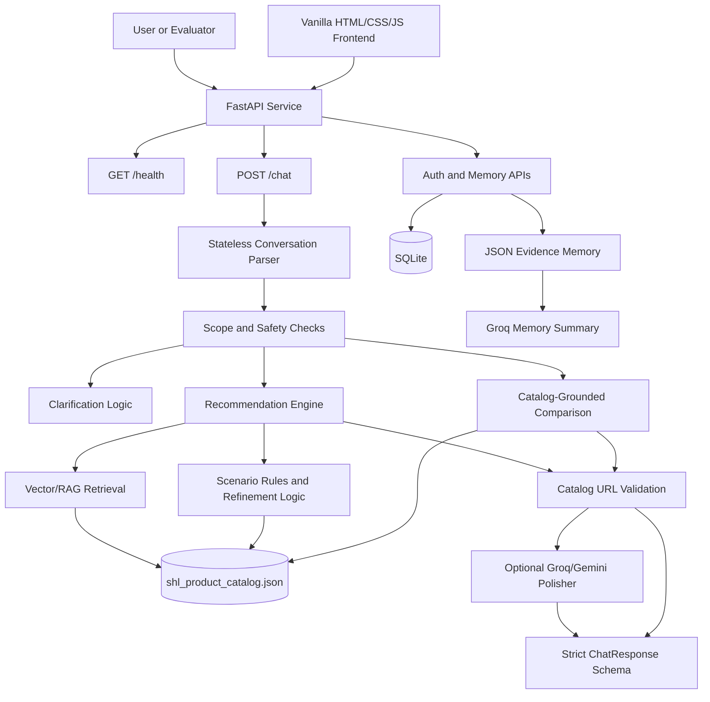

# Conversational SHL Assessment Recommender

A catalog-grounded conversational agent for selecting SHL Individual Test Solutions. The assistant helps recruiters and hiring managers move from vague hiring intent to a concise, defensible shortlist of SHL assessments through clarification, recommendation, refinement, and comparison.

The system exposes a strict FastAPI contract for automated evaluation and includes a vanilla HTML, CSS, and JavaScript frontend for interactive use with login-based memory.

## Project Overview

Traditional assessment catalogs expect users to know the right keywords and filters before they search. This project takes a conversational approach instead. A user can describe a role in natural language, paste a job description, revise constraints mid-conversation, or ask how two assessments differ.

The recommender is grounded in the scraped SHL product catalog:

- Scope: SHL Individual Test Solutions only
- Source of truth: `shl_product_catalog.json`
- Out of scope: pre-packaged job solutions, legal advice, general hiring advice, and non-SHL assessments
- Output safety: every recommendation URL must exist in the scraped catalog

## Key Capabilities

1. Clarifies vague requests before recommending
   - Example: "I need an assessment" returns a clarification question and no shortlist.

2. Recommends 1 to 10 catalog-backed assessments
   - Each recommendation includes `name`, `url`, and `test_type`.
   - URLs are validated against the local catalog before being returned.

3. Refines existing shortlists
   - Follow-up requests such as "Actually, add personality tests" or "drop OPQ" update the prior shortlist instead of restarting from scratch.

4. Compares assessments using catalog evidence
   - Comparison questions such as "What is the difference between OPQ and GSA?" are answered from catalog data, not model prior knowledge.

5. Stays in scope
   - Refuses legal questions, general hiring advice, prompt-injection attempts, and off-catalog recommendations.

6. Supports optional LLM polishing
   - Groq and Gemini can polish responses and summarize memory.
   - Deterministic catalog validation remains the final safety layer.

7. Stores user memory
   - Authenticated users get SQLite records plus JSON evidence files.
   - Memory can persist on Hugging Face Spaces through `/data` persistent storage.

## Architecture



## Technology Stack

Backend:

- Python 3.11
- FastAPI
- Uvicorn
- Pydantic
- SQLite
- bcrypt

Retrieval and recommendation:

- Local SHL catalog JSON
- FAISS vector retrieval
- Optional Sentence Transformers embeddings
- Deterministic scenario rules
- Catalog URL validation

LLM layer:

- Groq API
- Google Gemini API
- Provider and model rotation through environment variables
- Safe fallback to deterministic replies if LLM calls fail

Frontend:

- Vanilla HTML
- Vanilla JavaScript
- CSS glassmorphism UI
- Login page
- Chatbot page
- Visual memory analytics page

Deployment:

- Docker
- Hugging Face Spaces compatible
- Persistent SQLite and JSON memory through `/data`

## Repository Structure

```text
.
├── app/
│   ├── main.py                 # FastAPI app and route wiring
│   ├── recommender.py          # Core SHL recommendation behavior
│   ├── catalog.py              # Catalog loading, search, and item utilities
│   ├── insights.py             # Shortlist summaries and card details
│   ├── llm.py                  # Groq/Gemini response polishing and memory summaries
│   ├── storage.py              # SQLite users, conversations, and JSON evidence memory
│   ├── config.py               # Environment and persistent path resolution
│   └── models.py               # Request/response schemas
├── frontend/
│   ├── index.html              # Landing page
│   ├── login.html              # Login and registration page
│   ├── chatbot.html            # Chat UI
│   ├── memory.html             # Visual memory analytics UI
│   ├── chat.js                 # Chat behavior and shortlist rendering
│   ├── auth.js                 # Login/register behavior
│   ├── memory.js               # Memory dashboard behavior
│   └── styles.css              # UI styling
├── scripts/
│   └── evaluate.py             # Local behavioral and schema checks
├── GenAI_SampleConversations/  # Example conversation traces
├── shl_product_catalog.json    # Scraped SHL catalog source of truth
├── requirements.txt
├── Dockerfile
├── .env.example
└── README.md
```

## API Contract

### Health Check

```http
GET /health
```

Response:

```json
{
  "status": "ok"
}
```

### Chat

```http
POST /chat
```

Request:

```json
{
  "messages": [
    {
      "role": "user",
      "content": "Hiring a Java developer who works with stakeholders"
    },
    {
      "role": "assistant",
      "content": "Sure. What is seniority level?"
    },
    {
      "role": "user",
      "content": "Mid-level, around 4 years"
    }
  ]
}
```

Response:

```json
{
  "reply": "Got it. Here are assessments that fit a mid-level Java developer with stakeholder needs.",
  "recommendations": [
    {
      "name": "Core Java (Advanced Level) (New)",
      "url": "https://www.shl.com/products/product-catalog/view/core-java-advanced-level-new/",
      "test_type": "K"
    },
    {
      "name": "Occupational Personality Questionnaire OPQ32r",
      "url": "https://www.shl.com/products/product-catalog/view/occupational-personality-questionnaire-opq32r/",
      "test_type": "P"
    }
  ],
  "end_of_conversation": false
}
```

The `/chat` endpoint is stateless for evaluation. Every call should include the full conversation history. Authenticated frontend users may also pass `user_id` so the app can store memory evidence, but the recommendation behavior does not depend on server-side conversation state.

## Local Setup

### 1. Create and activate a virtual environment

```powershell
cd D:\Projects\SHL
python -m venv .venv
.\.venv\Scripts\Activate.ps1
```

### 2. Install dependencies

```powershell
pip install -r requirements.txt
```

### 3. Configure environment variables

```powershell
Copy-Item .env.example .env
```

Add keys only if you want LLM-polished responses and Groq memory summaries. The app still works without keys using deterministic catalog logic.

Single-key mode:

```env
GROQ_API_KEY=gsk_...
GEMINI_API_KEY=AIza...
```

Multi-key rotation mode:

```env
GROQ_API_KEYS=gsk_key_1,gsk_key_2
GEMINI_API_KEYS=gemini_key_1,gemini_key_2
LLM_PROVIDER_ORDER=groq,gemini
LLM_MAX_ATTEMPTS=8
```

### 4. Run the app

```powershell
python -m uvicorn app.main:app --reload --host 127.0.0.1 --port 8080
```

Open:

```text
http://127.0.0.1:8080/
```

## Evaluation

Run:

```powershell
python scripts/evaluate.py
```

The evaluation script checks:

- `/health` readiness
- `/chat` schema compliance
- vague-query clarification
- catalog-only URL grounding
- recommendation relevance for common role traces
- refinement behavior
- comparison behavior
- refusal behavior for legal, off-topic, and prompt-injection requests

## Persistence and Memory

Local storage defaults:

```text
storage/shl_recommender.sqlite3
storage/evidence/
```

For each authenticated user, the app stores:

- user account record in SQLite
- conversation record in SQLite
- JSON evidence file per conversation
- `memory.json` with rolling summary and conversation history

Memory endpoint:

```http
GET /users/{user_id}/memory
```

The visual dashboard is available from the frontend through:

```text
/memory/{user_id}
```

## Hugging Face Spaces Deployment

Use a Docker Space.

### 1. Create the Space

Go to:

```text
https://huggingface.co/new-space
```

Select:

- SDK: Docker
- Hardware: CPU is enough for deterministic mode
- Visibility: Public or Private

### 2. Add Space secrets

In Hugging Face:

```text
Space Settings -> Variables and secrets
```

Recommended secrets:

```env
GROQ_API_KEYS=your_groq_keys
GEMINI_API_KEYS=your_gemini_keys
APP_SECRET_KEY=replace-with-a-long-random-secret
PERSISTENT_DIR=/data/shl-recommender
ENABLE_SENTENCE_TRANSFORMER=false
```

### 3. Enable persistent storage

In the Space settings, enable persistent storage. Once enabled, Hugging Face mounts `/data`.

The app automatically stores persistent files at:

```text
/data/shl-recommender/shl_recommender.sqlite3
/data/shl-recommender/evidence/
```

### 4. Runtime command

The included Dockerfile runs:

```bash
uvicorn app.main:app --host 0.0.0.0 --port 7860
```

Hugging Face Spaces expects port `7860`.

## Git LFS

Git LFS is used for catalog and data-style assets so the repository remains manageable as the catalog grows.

Typical setup:

```powershell
git lfs install
git lfs track "*.json"
git lfs track "GenAI_SampleConversations/*.md"
git add .gitattributes
```

Do not commit `.env`, `storage/`, `.venv/`, or generated cache folders.

## Deployment Notes

- Keep API keys in Hugging Face Secrets or local `.env`, never in Git.
- Keep `ENABLE_SENTENCE_TRANSFORMER=false` for faster and lighter cold starts.
- The evaluator only needs `/health` and `/chat`.
- SQLite memory is optional for evaluator use, but useful for the frontend login experience.
- If persistent storage is not enabled on Hugging Face, user memory may reset after rebuilds or restarts.

## LLM Used

The implementation supports:

- Groq-hosted models, configured through `GROQ_API_KEY`, `GROQ_API_KEYS`, `GROQ_MODEL`, and `GROQ_MODELS`
- Google Gemini models, configured through `GEMINI_API_KEY`, `GEMINI_API_KEYS`, and `GEMINI_MODELS`

The core recommender is not purely LLM-generated. It is catalog-grounded with deterministic validation against `shl_product_catalog.json`.

## License and Catalog Notice

This project is built for an SHL assessment recommendation task. The catalog data should be used only for the intended evaluation or authorized project context. SHL product names and catalog URLs belong to SHL and its affiliates.
